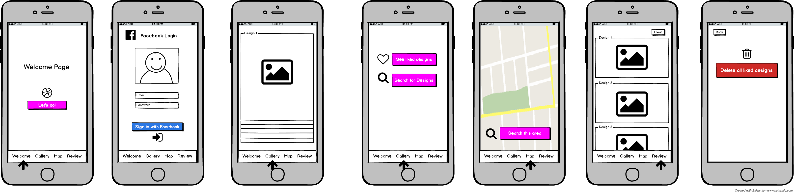
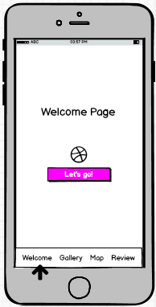

# Tinder for Designers

## A Gallery APP built with DRIBBLE API

- A gallery application using [Dribbble API](http://developer.dribbble.com/v1/), built using React-Native for both iOS and Android.

- This is built using [Expo XDE](https://expo.io/). Expo XDE stands for Expo Development Environment, and it helps everyone start, develop and publish React Native projects.

## Packages used in this project:

- [React Navigation](https://reactnavigation.org/): For `TabNavigator`, `StackNavigator`
- [React Native Elements](https://github.com/react-native-training/react-native-elements): For UI/UX Toolkit, including `Button`, `Icon`, `Card` etc.
- [Redux](http://redux.js.org/): A state management framework to reduce complex data into manageable data, important for scaling up application.
- [React Redux](https://github.com/reactjs/react-redux): Linking up Redux with React.
- [Redux Thunk](https://github.com/gaearon/redux-thunk): Middleware to delay dispatch of an action, or to dispatch only if certain condition is met.
- [Axios](https://www.npmjs.com/package/axios): For `XMLHttpRequests` from browser, `http or https` requests from node.js, supports `Promise` API.
- [Lodash](https://lodash.com/): For [AppLoading](https://docs.expo.io/versions/latest/sdk/app-loading.html)
- [latlng-to-zip](https://www.npmjs.com/package/latlng-to-zip): For [`reverseGeocode`](https://developers.google.com/maps/documentation/geocoding/start) (coming soon)
- [qs](https://www.npmjs.com/package/qs): For QueryString parsing and `stringify` library.
- Note: To install the above packages, run `$ npm install --save <package name>`

## APP Mock-up:

- Total 5 screens: WelcomeScreen, AuthScreen, DeckScreen, MapScreen, ReviewScreen & SettingScreen

### WelcomeScreen:

- Consists of 3 slides to show some welcome greetings to user.
- Content and color of slides are stored in WelcomeScreen.js/SLIDE_DATA
- Color Scheme of Dribbble is Fuschia/Black/Grey/White:

