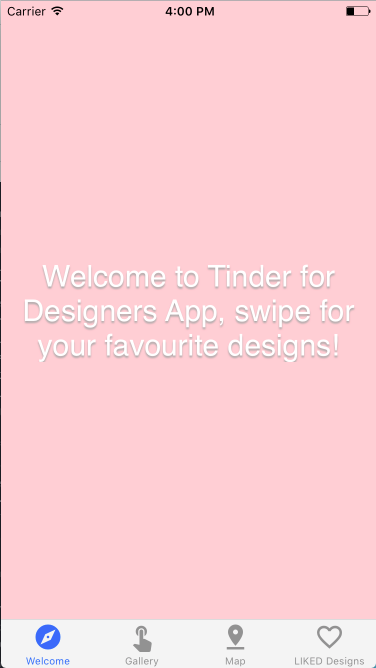
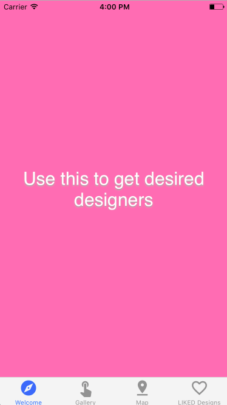
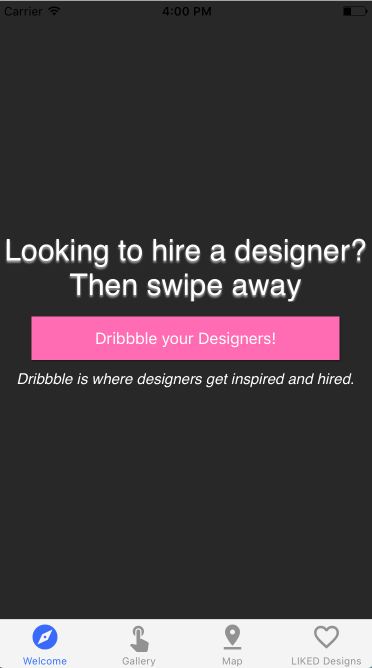
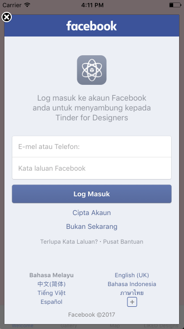
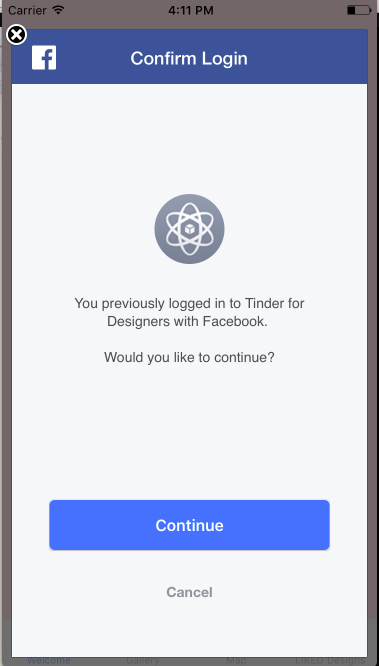
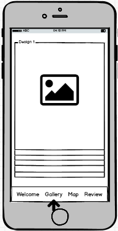
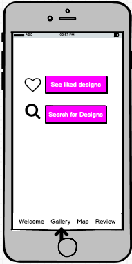
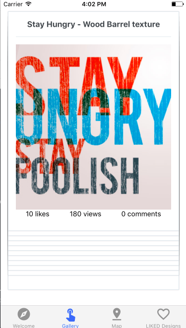
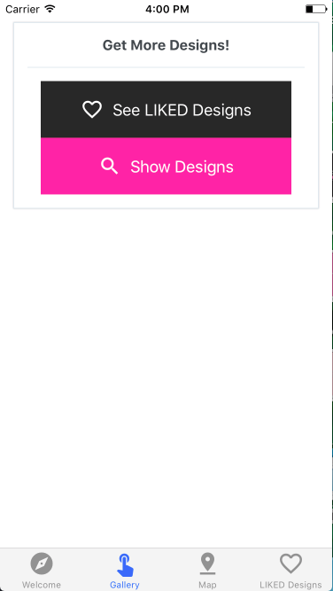

# Tinder for Designers

## A Gallery APP built with DRIBBLE API

- A gallery application using [Dribbble API](http://developer.dribbble.com/v1/), built using React-Native for both iOS and Android.

- This is built using [Expo XDE](https://expo.io/). Expo XDE stands for Expo Development Environment, and it helps everyone start, develop and publish React Native projects.

## Packages used in this project:

- [React Navigation](https://reactnavigation.org/): For `TabNavigator`, `StackNavigator`
- [React Native Elements](https://github.com/react-native-training/react-native-elements): For UI/UX Toolkit, including `Button`, `Icon`, `Card` etc.
- [Redux](http://redux.js.org/): A state management framework to reduce complex data into manageable data, important for scaling up application.
- [React Redux](https://github.com/reactjs/react-redux): Linking up Redux with React.
- [Redux Thunk](https://github.com/gaearon/redux-thunk): Middleware to delay dispatch of an action, or to dispatch only if certain condition is met.
- [Axios](https://www.npmjs.com/package/axios): For `XMLHttpRequests` from browser, `http or https` requests from node.js, supports `Promise` API.
- [Lodash](https://lodash.com/): For [AppLoading](https://docs.expo.io/versions/latest/sdk/app-loading.html)
- [latlng-to-zip](https://www.npmjs.com/package/latlng-to-zip): For [`reverseGeocode`](https://developers.google.com/maps/documentation/geocoding/start) (coming soon)
- [qs](https://www.npmjs.com/package/qs): For QueryString parsing and `stringify` library.
- Note: To install the above packages, run `$ npm install --save <package name>`

## APP Mock-up:

- Total 5 screens: WelcomeScreen, AuthScreen, DeckScreen, MapScreen, ReviewScreen & SettingScreen

### App.js:
- Define abbr for all screens and nested under `TabNavigator` or `StackNavigator` accordingly. Eg. `welcome` is `WelcomeScreen` and so forth.
- Link-up react and redux store: import `store`, use `Provider` tag to wrap the whole `view container` & `MainNavigator`.
- `lazyLoad` (or latest syntax `lazy`), is to delay the screen loading until the screen/object is being called.

### WelcomeScreen:

Mock-up:

- Consists of 3 slides to show some welcome greetings to user.
- Content and color of slides are stored in `WelcomeScreen.js/SLIDE_DATA`
- Color Scheme of Dribbble is Fuschia/White/Grey/Black:
<h2>

</h2>
- Condition checking: when APP starts up, check whether user is logged-in `AsyncStorage.getItem('fb_token')?`, if logged-in then redirect to `DeckScreen` (abbr: `deck`, as defined in `App.js`). All this process is hide under `AppLoading`, until the next component is being rendered.
- All slides are rendered using `Slides.js`, which includes `styling` for slides, `ScrollView`, and to show button when last slide is rendered.

- Outcome of WelcomeScreen:
<h2>
  
</h2>

### AuthScreen:

Mock-up:

- Uses Facebook API integrated in Expo, call `Expo.Facebook.logInWithReadPermissionsAsync`.
- Facebook login actions are in `actions/auth_actions.js`, export 2 actions: `FACEBOOK_LOGIN_SUCCESS` `FACEBOOK_LOGIN_FAIL`. Then the outcome of the action (`action.payload`) is stored in `auth_reducer.js`, and all the reducers are combined under `reducers/index.js` using `combineReducers`. In this case, it is combined as `auth`.
- This `auth` reducer is mapped as `token` in `AuthScreen` using `mapStateToProps`, then `props` and `actions` are connected to the screen using `connect()` in react-redux library.

- Outcome of AuthScreen:
<h2>
 
</h2>

### DeckScreen
Mock-up:

- API calls are made using `Axios`, from Dribbble API end-point: https://api.dribbble.com/v1.
- URL is refactored out by setting root URL, params, id separately; and put all these together as required URL using `qs` library.
- `Shot_id` is randomized by assigning random number.
- This action, `FETCH_SHOTS` is being exported to  `DeckScreen.js`. Once the button is pressed, this action will be called.
- `Swipe.js` component is separated from the screen, this is to simplify the code and separation of concerns. `Animated.view` is to animate object(s) on screen, while `PanResponder` handles the gesture of user interaction (swipe left or right).
- By calling `Swipe.js` into `DeckScreen.js`, following information are required:

| Information | Description |
| ------ | ------ |
| data | Input data |
| renderCard | Show data as cards for users to swipe |
| renderNoMoreCards | Handles argument when no more card is available |
| onSwipeRight | Store the data as `LIKED_SHOT` |
| keyProp | Define unique key to render cards |

- Outcome of DeckScreen:
<h2>
 
</h2>
